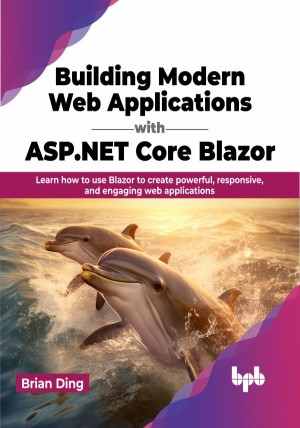

# Building Modern Web Applications with ASP.NET Core Blazor

Learn Blazor from the ground up, with step-by-step instructions and code examples

This is the repository for [Building Modern Web Applications with ASP.NET Core Blazor
](https://bpbonline.com/products/building-modern-web-applications-with-asp-net-core-blazor?variant=42842619609288),published by BPB Publications. 

## About the Book
Building Modern Web Applications with ASP.NET Core Blazor is the ultimate guide to developing high-quality web applications with Blazor and .NET Core. Written by an experienced developer, this book provides a comprehensive overview of Blazor's architecture, components, deployment options, and best practices for optimizing performance and scalability.

It begins by introducing WebAssembly, the technology that makes Blazor possible. It then discusses the different hosting models available for Blazor applications. Next, the book covers the basics of building Blazor applications, including how to create components, handle user input, and navigate between pages. The book then delves into more advanced topics, such as uploading and downloading files, using .NET and JavaScript interoperability, connecting to the world with HTTP, persisting data with EF Core, and protecting your application with identity. Finally, the book shows you how to deploy your Blazor application with Docker and Kubernetes.

By the end of the book, you will be able to build modern, interactive web applications using Blazor and .NET Core.

## What You Will Learn
•  Gain the ability to develop interactive web applications effortlessly, while building a strong sense of confidence.

•  Get familiar with the components model, common design patterns, and solutions implemented in Blazor.

•  Learn how to seamlessly integrate and reuse legacy code by leveraging JavaScript interop capabilities within Blazor.

•  Discover optimization techniques and best practices for enhancing application performance and scalability.

•  Develop a solid grasp of key concepts in .NET Core backend development, including protocols and middleware.
